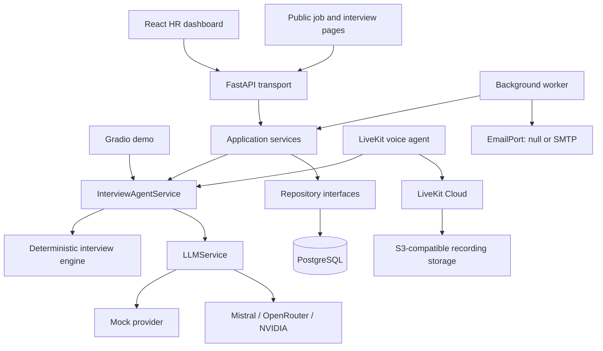

# AI Voice Interview Platform

An end-to-end platform for structured, evidence-based candidate screening. Recruiters can configure positions and interview questions, publish public application pages, run browser-based AI voice interviews, and review transcript-backed screening reports from one dashboard.

The platform supports recruiters; it does not make final employment decisions. Interview plans remain human-approved, every scored category requires transcript evidence, and the final decision remains with the recruiter or hiring manager.

## Project overview

Early-stage candidate screening is difficult to scale consistently. Manual screens consume recruiter time, while unstructured automation can produce generic questions, weak auditability, and opaque recommendations. This project addresses that gap with a controlled workflow that combines:

- role-specific, recruiter-approved interview plans;
- a browser voice experience with bounded adaptive follow-ups;
- deterministic scoring and configurable initial screening thresholds;
- transcript-traceable evidence and explicit insufficient-evidence handling;
- a human-owned review workflow in the HR dashboard.

Demo / Mock Mode is the default. It runs the complete core interview flow without an API key and clearly labels simulated output.

## Main capabilities

- Recruiter registration and JWT-based authentication.
- Position, question, candidate, interview-plan, persona, queue, and pipeline management.
- PDF, DOCX, TXT, and Markdown CV/JD parsing with size and format validation.
- Manual per-candidate interview planning and position-level approved templates for the automated pipeline.
- Public job pages and candidate applications behind a configurable kill switch and rate limits.
- Browser-based LiveKit voice interviews with STT, TTS, interruption handling, reconnect feedback, silence handling, and a typed-answer fallback.
- A background worker with atomic queue claiming, leases, deterministic retries, candidate prewarming, evaluation, invitation expiry, and email-outbox processing.
- Best-effort invitation delivery through a no-op default or SMTP, with retry and per-invitation idempotency.
- Optional LiveKit egress recording to S3-compatible storage and persisted voice transcripts.
- Evidence-based evaluation, deterministic weighted scoring, and configurable `PASS`, `FAIL`, or `NEEDS_REVIEW` initial screening outcomes.
- A local Gradio harness for the deterministic text-interview demo.
- LLM adapters for Mock Mode, Mistral, OpenRouter, and NVIDIA NIM.

## AI voice interview workflow

1. A recruiter creates a position, defines or generates questions, configures the rubric and pass threshold, and approves the screening template.
2. The recruiter publishes the position, enabling its public application page.
3. A candidate applies and uploads a CV. The existing candidate and document-processing services create the candidate record and materialize the approved plan.
4. The platform creates a signed interview invitation. The link is always available in the dashboard; email delivery is additive and never blocks access.
5. The candidate opens the browser interview and explicitly starts the session. LiveKit carries audio while the existing `InterviewAgentService` remains responsible for interview state.
6. Speech is transcribed, the deterministic interview engine applies question order and follow-up limits, and the next prompt is synthesized back to the candidate.
7. On completion, the evaluator may score a category only when it can attach transcript evidence. Missing evidence remains unscored.
8. Python calculates the weighted overall score, evidence coverage, recommendation label, and initial screening outcome from the configured rubric.
9. The recruiter reviews the transcript, evidence, report, and screening result and makes the human decision.

## High-level architecture



The transport layers contain presentation and protocol concerns only. FastAPI, React, Gradio, and LiveKit all delegate interview behavior to the application layer and `InterviewAgentService`. Integration SDKs are confined to their service packages and exposed through interfaces with no-op or local implementations where appropriate.

More detail is available in [docs/ARCHITECTURE.md](docs/ARCHITECTURE.md).

## Tech stack

| Area | Technology |
| --- | --- |
| Backend and application core | Python 3.11+, FastAPI, Pydantic |
| Persistence and migrations | PostgreSQL, SQLAlchemy, Psycopg, Alembic |
| Frontend | React 19, TypeScript, Vite, Tailwind CSS |
| Voice | LiveKit Agents, LiveKit browser SDK, hosted STT/TTS/voice inference |
| AI providers | Deterministic mock, Mistral, OpenRouter, NVIDIA NIM |
| Documents | PyPDF, python-docx |
| Email | Standard-library SMTP behind an `EmailPort` abstraction |
| Testing | pytest, Vitest, Testing Library, ESLint, TypeScript |

## Repository structure

```text
agents/          AI analysis, interview planning, follow-up, and evaluation agents
api/             FastAPI application, schemas, routers, auth, and composition
application/     Transport-neutral use cases and orchestration services
config/          Runtime settings and deterministic scoring rubrics
docs/            Maintained architecture and engineering safeguards
frontend/        React/TypeScript HR dashboard and public candidate experience
migrations/      Alembic database migrations
models/          Pydantic domain models
prompts/         Centralized provider prompts and safety instructions
sample_data/     Clearly labeled fictional demo inputs and answers
services/        Persistence, LLM, email, LiveKit, parsing, scoring, and reporting
templates/       Transactional invitation email templates
tests/           Unit, integration, governance, UI, and end-to-end tests
ui/              Thin Gradio demo adapter
app.py           Local Gradio demo entrypoint
voice_agent.py   LiveKit voice-agent entrypoint
worker.py        Queue, invitation, and email-outbox worker entrypoint
```

## Local setup

### Prerequisites

- Python 3.11 or newer
- Node.js 20.19 or newer
- PostgreSQL for the FastAPI platform and background worker
- A LiveKit Cloud project only when running real voice interviews

### Install dependencies

From the repository root:

```powershell
python -m venv .venv
.\.venv\Scripts\Activate.ps1
python -m pip install --upgrade pip
python -m pip install -r requirements.txt
Copy-Item .env.example .env
```

Install real LLM provider clients only when needed:

```powershell
python -m pip install -r requirements-llm.txt
```

Install the frontend:

```powershell
Set-Location frontend
npm ci
Copy-Item .env.example .env
Set-Location ..
```

### Configure PostgreSQL

Create an application database, set `DATABASE_URL` in the root `.env`, and apply migrations:

```powershell
alembic upgrade head
```

Generate a unique JWT signing key for local development or deployment; do not commit it:

```powershell
python -c "import secrets; print(secrets.token_urlsafe(48))"
```

Copy the result into `JWT_SECRET_KEY` in `.env`. Use a separate disposable database and `TEST_DATABASE_URL` only when running PostgreSQL-backed tests.

## Environment configuration

Both environment templates contain placeholders and safe defaults only. Keep actual values in the ignored root `.env` and optional `frontend/.env` files.

| Group | Important variables |
| --- | --- |
| Runtime | `MOCK_MODE`, `LOG_LEVEL`, document and follow-up limits |
| LLM | `LLM_PROVIDER` plus the selected provider's API key and model |
| Database/API | `DATABASE_URL`, `JWT_SECRET_KEY`, `CORS_ALLOWED_ORIGINS` |
| Public applications | `PUBLIC_APPLICATIONS_ENABLED`, public apply rate limit |
| Queue worker | lease, polling, and deterministic retry settings |
| Voice | `INTERVIEW_TRANSPORT`, `LIVEKIT_URL`, `LIVEKIT_API_KEY`, `LIVEKIT_API_SECRET`, voice models and turn-taking settings |
| Invitations | `VOICE_PUBLIC_BASE_URL`, `VOICE_INVITE_SECRET`, token and session timeouts |
| Recording | `RECORDING_ENABLED`, consent settings, S3-compatible storage values |
| Email | `EMAIL_PROVIDER`, sender values, SMTP settings, outbox retry limit |
| Frontend | `VITE_API_BASE_URL` (blank uses the local Vite proxy) |

Key defaults are intentionally conservative:

- `MOCK_MODE=true`: no real model call.
- `INTERVIEW_TRANSPORT=null`: no real LiveKit room.
- `EMAIL_PROVIDER=null`: no real email.
- `RECORDING_ENABLED=false`: no recording or egress.
- `PUBLIC_APPLICATIONS_ENABLED=false`: public application routes are not registered.

See [.env.example](.env.example) for the full configuration surface and validation notes.

## Run the platform

Run each long-lived process in a separate terminal from the repository root.

### Backend API

Requires `DATABASE_URL` and `JWT_SECRET_KEY`:

```powershell
python -m uvicorn api.app:create_app --factory --host 127.0.0.1 --port 8000
```

API documentation is available at `http://127.0.0.1:8000/docs`.

### Frontend

```powershell
Set-Location frontend
npm run dev
```

The development server uses `http://localhost:5173` and proxies `/api` and `/health` to the local backend when `VITE_API_BASE_URL` is blank.

### Background worker

```powershell
python worker.py
```

The worker requires PostgreSQL. With the default null transport and null email provider it runs without LiveKit or SMTP credentials.

### Voice worker

Set `INTERVIEW_TRANSPORT=livekit` and provide the `LIVEKIT_*` credentials, then run:

```powershell
python voice_agent.py dev
```

The default `VOICE_ENGINE=v2` uses the current streaming voice implementation. `VOICE_ENGINE=v1` retains the earlier compatible implementation as a configuration-level fallback.

### Local Gradio demo

The text-based demo uses the in-memory store and works with the default Mock Mode settings:

```powershell
python app.py
```

Open `http://127.0.0.1:7860`. The UI labels the session **Demo / Mock Mode** and the files in `sample_data/` are fictional.

## Testing and quality checks

Run the Python suite without creating a pytest cache:

```powershell
python -m pytest -q -p no:cacheprovider
```

Without `TEST_DATABASE_URL`, PostgreSQL-backed tests skip safely. When configured, it must point to a separate disposable database because those fixtures rebuild the schema.

Run frontend checks from `frontend/`:

```powershell
npm run test
npm run lint
npm run build
```

The suites cover deterministic mock behavior, interview state and follow-up limits, evidence and scoring rules, session isolation, security logging, API routes, persistence repositories, queue concurrency and recovery, email dispatch, public applications, voice behavior, React screens, and architecture boundaries.

## Security, privacy, and hiring safeguards

- Secrets are loaded from environment variables and are excluded from source control. Provider keys and participant tokens are never sent to the browser or written to logs.
- Logging records lengths, identifiers, timing, and hashes where needed; it must not record CVs, job descriptions, candidate answers, email bodies, email addresses, or invitation tokens.
- Candidate sessions are isolated, and stores return deep copies to prevent cross-session data leakage.
- Signed invitation links and short-lived LiveKit participant tokens limit access to candidate sessions.
- Recording is disabled by default. When enabled, storage must be configured, and consent behavior is explicit and versioned.
- A scored category requires transcript-traceable evidence. Otherwise it remains unscored with an insufficient-evidence result.
- Overall scoring, recommendation mapping, and initial screening outcomes are computed deterministically in Python from `config/rubrics.json`.
- The platform does not perform facial, emotion, accent, personality, biometric, or protected-attribute analysis.
- `PASS` and `FAIL` are configurable initial screening results, not final employment decisions. They do not automatically change candidate status or send a candidate-facing decision.
- A human recruiter approves interview content and remains responsible for the final decision.

Any production deployment should add organization-specific retention, deletion, access-control, encryption/key-management, monitoring, backup, incident-response, legal, fairness, and accessibility reviews.

## Current project status

The repository contains the working application core, FastAPI backend, React dashboard and public pages, PostgreSQL persistence and migrations, queue worker, LiveKit browser voice transport, optional recording/transcript support, transactional invitation email, deterministic evaluation/scoring, Gradio demo, and automated tests.

The following are intentionally not implemented: ATS integration, calendar integration, payments, automated reminder emails, outbound PSTN/telephone calling, OCR for scanned documents, Mem0/Qdrant memory, and autonomous final employment decisions. Deployment infrastructure and organization-specific production controls are also outside this repository.
